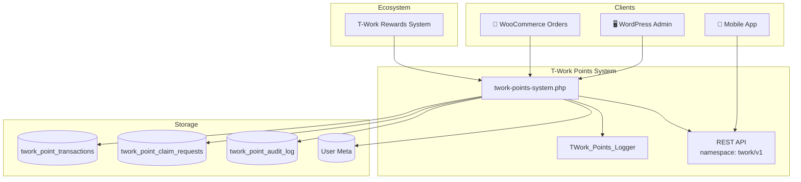

# 💎 T-Work Points System

[](https://wordpress.org/)
[](https://woocommerce.com/)
[](https://www.php.net/)
[](LICENSE)
[](https://github.com/tworksystem)
[](#-support)

> 🚀 A production-grade WordPress loyalty points engine for WooCommerce — ledger-backed balances, admin approval workflows, mobile REST APIs, and deep integration with the T-Work commerce ecosystem.

**T-Work Points System** is the authoritative point ledger for PLANETmm / T-Work mobile commerce platforms. It tracks earn, redeem, refund, expiry, referral, and birthday flows; exposes a secure `twork/v1` REST namespace for native apps; and integrates with **[T-Work Rewards System](https://github.com/tworksystem/twork-rewards-system)** for engagement polls, lucky box, and exchange workflows.

🏢 **Maintained by [T-WORK SYSTEM Co.,Ltd.](https://github.com/tworksystem)**

---

## 📋 Table of Contents

- [✨ Highlights](#-highlights)
- [🏗️ Architecture Overview](#️-architecture-overview)
- [🔗 T-Work Ecosystem](#-t-work-ecosystem)
- [📦 Requirements](#-requirements)
- [⚡ Quick Start](#-quick-start)
- [⚙️ Configuration](#️-configuration)
- [🎯 Core Modules](#-core-modules)
- [🔌 REST API Reference](#-rest-api-reference)
- [🗄️ Database Schema](#️-database-schema)
- [🛡️ Security & Permissions](#️-security--permissions)
- [🧪 Testing](#-testing)
- [📁 Project Structure](#-project-structure)
- [🛠️ Development](#️-development)
- [🚀 Deployment](#-deployment)
- [🔧 Troubleshooting](#-troubleshooting)
- [🤝 Contributing](#-contributing)
- [📜 Changelog](#-changelog)
- [📄 License](#-license)
- [👤 Author & Support](#-author--support)

---

## ✨ Highlights

| Area | What you get |
|------|----------------|
| 💰 **Point Ledger** | Single source of truth via `twork_point_transactions` with status lifecycle |
| 🛒 **WooCommerce** | Pending earn on order creation; refunds on cancel/refund |
| ✅ **Admin Approval** | Pending → approved/rejected workflow before balance changes |
| 📱 **Mobile REST API** | Balance, transactions, earn, redeem, sync, expiry, referral, birthday |
| 💱 **Claim / Exchange** | Mobile claim requests reviewed by admin before deduction |
| 🎰 **Lucky Box** | Per-user config and open requests (spin wheel backward compat) |
| 📝 **Custom Fields** | Dynamic user field definitions exposed via REST |
| 🔔 **FCM Token** | `/register-token` endpoint for push notification registration |
| 🗳️ **Poll Integration** | `deduct_for_poll_vote()` for engagement poll staking |
| 📊 **Admin Dashboard** | Users, transactions, exchange requests, reports, exports |
| 📋 **Audit Log** | Admin adjustment history in dedicated audit table |
| 🧪 **PHPUnit Tests** | Transaction duplicate prevention and refund integrity tests |

---

## 🏗️ Architecture Overview



**Design principles**

- **Ledger-first balance** — `get_user_point_balance()` reads from transactions with meta fallback for migration safety.
- **Idempotent order handling** — Unique `(user_id, order_id, type)` constraint prevents duplicate earns.
- **Admin-gated lifecycle** — Orders create **pending** transactions; admins approve before points apply.
- **Sync resilience** — Rolling sync error tracking with admin notices after threshold breaches.
- **Backward-compatible REST** — Spin wheel routes map to lucky box for older app versions.

---

## 🔗 T-Work Ecosystem

| Plugin | Role |
|--------|------|
| 💎 **T-Work Points System** *(this repo)* | Authoritative point ledger, balance APIs, poll deductions |
| 🎁 **[T-Work Rewards System](https://github.com/tworksystem/twork-rewards-system)** | Engagement hub, polls, lucky box UI, exchange REST |
| 🔔 **T-Work FCM Notify** | Push notifications on point events |

Browse all official plugins at **[github.com/tworksystem](https://github.com/tworksystem)**.

---

## 📦 Requirements

| Dependency | Minimum Version |
|------------|-----------------|
| WordPress | 5.0+ |
| PHP | 7.4+ |
| WooCommerce | 5.0+ |
| MySQL / MariaDB | 5.6+ |

**Recommended PHP extensions:** `json`, `mysqli`, `curl`, `mbstring`

---

## ⚡ Quick Start

### 📥 Manual Installation

1. Clone or copy this repository into `wp-content/plugins/twork-points-system/`.
2. Activate **T-Work Points System** from **Plugins** in wp-admin.
3. Open **T-Work Points → Settings** and configure earn/redeem rules.
4. Flush permalinks: **Settings → Permalinks → Save Changes**.

### 🔗 Clone via Git

```bash
cd wp-content/plugins
git clone https://github.com/tworksystem/twork-points-system.git twork-points-system
```

> 📁 **Folder name matters:** WordPress expects the directory name `twork-points-system`, not `twork-rewards-system`.

### ✅ Post-Activation Checklist

- [ ] Verify tables `twork_point_transactions`, `twork_point_claim_requests`, `twork_point_audit_log` exist
- [ ] Configure points-per-order and expiry settings
- [ ] Test `GET /wp-json/twork/v1/points/balance/{user_id}`
- [ ] Place a test order and confirm a **pending** earn transaction appears
- [ ] Approve a transaction in admin and verify balance updates in the app

---

## ⚙️ Configuration

Navigate to **T-Work Points** in wp-admin:

| Screen | Purpose |
|--------|---------|
| 📊 **Dashboard** | Overview metrics and quick actions |
| ⚙️ **Settings** | Earn rate, expiry, sync, lucky box, referral/birthday rules |
| 👥 **User Points** | Per-user balance view and manual adjustments |
| 📜 **Transactions** | Full ledger with status filters, trash/restore, bulk actions |
| 💱 **Exchange Requests** | Review mobile claim/exchange submissions |
| 📈 **Reports & Tools** | Export, sync utilities, maintenance tools |
| 📝 **Custom Fields** | Define extra profile fields for mobile registration |

---

## 🎯 Core Modules

### 💰 Transaction Lifecycle

1. **Earn (pending)** — Created when WooCommerce order is placed or reaches processing/completed.
2. **Admin review** — Approve or reject from **Transactions** screen.
3. **Balance update** — Approved transactions update `get_user_point_balance()`.
4. **Refund** — Cancelled/refunded orders create offsetting refund entries.

### 💱 Claim / Exchange Requests

Mobile apps submit claim requests via REST. Points are **not** deducted until an admin approves the request in **Exchange Requests**.

### 🎰 Lucky Box & Spin Wheel

- `GET /luckybox/config/{user_id}` — Per-user enable/disable
- `POST /luckybox/open` — Creates pending lucky box transaction
- Legacy apps use `/spinwheel/config` and `/spinwheel/spin` (mapped internally)

### 🗳️ Poll Vote Deduction

When **[T-Work Rewards System](https://github.com/tworksystem/twork-rewards-system)** handles poll betting, it calls:

```php
TWork_Points_System::get_instance()->deduct_for_poll_vote($user_id, $points, $description);
```

This deducts stakes atomically against the ledger balance.

### 📝 Custom Fields

Define dynamic registration/profile fields in admin. Mobile apps read and write values through REST.

### 📋 Structured Logging

`TWork_Points_Logger` writes rotated logs to `wp-content/uploads/twork-points/logs/points.log` with PSR-style levels.

---

## 🔌 REST API Reference

**Base URL:** `{site}/wp-json/twork/v1`

**Authentication:** WooCommerce REST auth, Application Passwords, or cookie auth via `check_woocommerce_auth()`.

### 💰 Points

| Method | Endpoint | Description |
|--------|----------|-------------|
| `GET` | `/points/balance/{user_id}` | Current balance + lifetime stats |
| `GET` | `/points/transactions/{user_id}` | Paginated transaction history |
| `POST` | `/points/earn` | Earn points (controlled contexts) |
| `POST` | `/points/redeem` | Redeem points |
| `POST` | `/points/claim-request` | Submit exchange/claim (pending admin review) |
| `POST` | `/points/sync` | Bulk sync local app transactions |
| `POST` | `/points/sync-balance/{user_id}` | Force balance recalculation |
| `GET` | `/points/expiring/{user_id}` | Points expiring soon |
| `POST` | `/points/check-expired/{user_id}` | Mark expired points |
| `POST` | `/points/referral` | Award referral bonus |
| `POST` | `/points/birthday` | Award birthday bonus |

### 📝 Custom Fields

| Method | Endpoint | Description |
|--------|----------|-------------|
| `GET` | `/custom-fields/definitions` | Field schema definitions |
| `GET` | `/custom-fields/user/{user_id}` | Read user field values |
| `POST` | `/custom-fields/user/{user_id}` | Save user field values |

### 🎰 Lucky Box / Spin Wheel

| Method | Endpoint | Description |
|--------|----------|-------------|
| `GET` | `/luckybox/config/{user_id}` | Lucky box config |
| `POST` | `/luckybox/open` | Submit open request |
| `GET` | `/spinwheel/config` | Legacy spin wheel config |
| `POST` | `/spinwheel/spin` | Legacy spin wheel open |

### 🔔 Push Notifications

| Method | Endpoint | Description |
|--------|----------|-------------|
| `POST` | `/register-token` | Register FCM device token (public) |

### 📦 Response Examples

**Balance:**

```json
{
  "user_id": "123",
  "current_balance": 500,
  "lifetime_earned": 1000,
  "lifetime_redeemed": 300,
  "lifetime_expired": 200,
  "last_updated": "2026-05-24 10:30:00"
}
```

**Earn success:**

```json
{
  "success": true,
  "transaction_id": 789,
  "new_balance": 600
}
```

### 🔑 Example Request (cURL)

```bash
curl -X GET "https://your-site.com/wp-json/twork/v1/points/balance/123" \
  -u "consumer_key:consumer_secret"
```

---

## 🗄️ Database Schema

Tables created on activation (prefix `{wp_prefix}`):

| Table | Purpose |
|-------|---------|
| `twork_point_transactions` | Authoritative ledger (earn/redeem/refund/adjust) with expiry and status |
| `twork_point_audit_log` | Admin manual adjustment audit trail |
| `twork_point_claim_requests` | Mobile exchange/claim submissions awaiting approval |

**Key indexes:** `uniq_user_order_type`, `idx_user_expires`, `idx_status`, `idx_user_status`

Migrations run idempotently via `twork_points_db_version` option.

---

## 🛡️ Security & Permissions

- ✅ Nonce verification on all admin POST handlers
- ✅ Capability checks (`manage_woocommerce` / `manage_options`)
- ✅ REST `check_woocommerce_auth()` for authenticated mobile access
- ✅ Prepared SQL via `$wpdb->prepare()`
- ✅ Duplicate transaction prevention via unique constraints
- ✅ Sync error rate limiting with admin alerts
- 🔒 Audit log tracks admin user ID for every manual adjustment

---

## 🧪 Testing

PHPUnit tests cover critical ledger integrity:

```bash
composer install
composer test
# or: vendor/bin/phpunit
```

**Test coverage includes:**

- Duplicate order transaction prevention
- Refund flow creating correct offset entries
- Balance calculation edge cases

---

## 📁 Project Structure

```
twork-points-system/
├── twork-points-system.php           # 🧠 Main plugin: hooks, REST, DB, admin
├── includes/
│   ├── class-twork-points-logger.php # 📋 Rotating structured logger
│   └── admin/
│       └── class-twork-points-admin.php
├── templates/admin/                  # 🖥️ Admin page templates
│   ├── dashboard.php
│   ├── settings.php
│   ├── transactions.php
│   ├── exchange-requests.php
│   └── ...
├── assets/
│   ├── css/admin.css
│   └── js/admin.js
├── tests/                            # 🧪 PHPUnit test suite
├── composer.json
├── phpunit.xml.dist
├── README.md
├── LICENSE
├── .gitignore
└── .gitattributes
```

---

## 🛠️ Development

### Local Setup

1. Use staging WordPress + WooCommerce — never test migrations on production first.
2. Enable `WP_DEBUG` and `WP_DEBUG_LOG`.
3. Run `composer install` for PHPUnit.

### Coding Standards

- [WordPress Coding Standards](https://developer.wordpress.org/coding-standards/wordpress-coding-standards/)
- Escape output, sanitize input, verify nonces
- Keep REST contracts backward-compatible for mobile apps

### Pre-Release Checklist

- [ ] Clean install creates all tables
- [ ] Order → pending transaction → approve → balance update
- [ ] Claim request approve/reject does not double-deduct
- [ ] Poll deduction via `deduct_for_poll_vote()` is atomic
- [ ] Expiry cron/check marks expired points correctly
- [ ] PHPUnit suite passes

---

## 🚀 Deployment

1. 🧪 Complete [Pre-Release Checklist](#pre-release-checklist) on staging.
2. 💾 Back up database and plugin directory.
3. 📤 Deploy via Git pull or CI pipeline.
4. 🔄 Re-save permalinks after deploy.
5. 👀 Monitor `uploads/twork-points/logs/points.log` and `debug.log`.

---

## 🔧 Troubleshooting

| Symptom | Likely cause | Fix |
|---------|--------------|-----|
| 🔴 REST 404 | Permalinks stale | **Settings → Permalinks → Save** |
| 🔴 Balance mismatch | Ledger out of sync | Use **Reports & Tools** or `POST /points/sync-balance/{user_id}` |
| 🔴 Duplicate earns | Order hook fired twice | Unique constraint returns existing ID — verify admin view |
| 🔴 Sync errors alert | App sync failures exceeded threshold | Check logs; review `twork_points_sync_error_state` option |
| 🔴 Claim stuck pending | Admin not reviewed | Approve/reject in **Exchange Requests** |

---

## 🤝 Contributing

Contributions welcome! 🙌

1. 🍴 Fork the repository
2. 🌿 Create a branch: `git checkout -b feat/your-feature`
3. ✍️ Commit with [Conventional Commits](#-commit-message-convention)
4. 📤 Open a Pull Request

### 📝 Commit Message Convention

```
feat: 24052026 - add birthday bonus REST endpoint
fix: 24052026 - prevent duplicate earn on checkout retry
docs: 24052026 - expand claim request workflow documentation
refactor: 24052026 - extract balance sync into dedicated method
chore: 24052026 - add PHPUnit bootstrap and WPDB stub
perf: 24052026 - index claim requests by status and created_at
test: 24052026 - cover refund offset transaction creation
```

| Type | When to use |
|------|-------------|
| `feat` | New feature |
| `fix` | Bug fix |
| `docs` | Documentation only |
| `refactor` | Code restructure, no behavior change |
| `chore` | Tooling / config |
| `perf` | Performance |
| `test` | Tests only |

---

## 📜 Changelog

### 🆕 v1.0.0 — May 2026

- 🎉 Official release on GitHub (`tworksystem/twork-points-system`)
- 💰 Ledger-backed point system with admin approval workflow
- 🛒 WooCommerce order hooks with refund handling
- 📱 Full `twork/v1` points REST API including sync and expiry
- 💱 Mobile claim/exchange request review flow
- 🎰 Lucky box + spin wheel backward compatibility
- 📝 Custom fields REST for mobile registration
- 🗳️ `deduct_for_poll_vote()` for engagement poll integration
- 📊 Admin dashboard with exports, reports, and audit log
- 🧪 PHPUnit tests for transaction integrity

---

## 📄 License

MIT License — see [LICENSE](LICENSE).

---

## 👤 Author & Support

**Maw Kunn Myat** · Lead Developer  
**T-WORK SYSTEM Co.,Ltd.**

| Channel | Link |
|---------|------|
| 📧 Primary Email | [mapoeeiphyu2017.miitinternship@gmail.com](mailto:mapoeeiphyu2017.miitinternship@gmail.com) |
| 📧 Support | [support@tworksystem.com](mailto:support@tworksystem.com) |
| 🏢 Organization | [@tworksystem](https://github.com/tworksystem) |
| 👤 Developer | [@mawkunnmyat](https://github.com/mawkunnmyat) |
| 📦 Repository | [github.com/tworksystem/twork-points-system](https://github.com/tworksystem/twork-points-system) |
| 🐛 Issues | [Report a bug](https://github.com/tworksystem/twork-points-system/issues) |
| 🏷️ Releases | [View releases](https://github.com/tworksystem/twork-points-system/releases) |

---

<div align="center">

**Version:** 1.0.0 · **Last Updated:** May 24, 2026 · **Maintained by:** T-WORK SYSTEM Co.,Ltd.

Made with ❤️ by [T-WORK SYSTEM](https://github.com/tworksystem)

</div>
